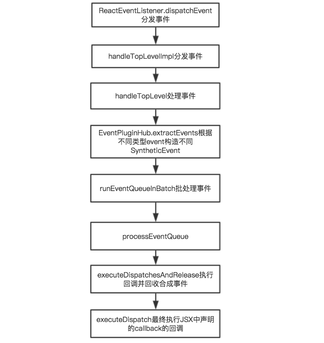

# 理解ReactElement和ReactClass的概念
`ReactElement`
一个描述DOM节点或component实例的字面级对象。它包含一些信息，包括组件类型 type 和属性 props 。就像一个描述DOM节点的元素（虚拟节点）。它们可以被创建通过 React.createElement 方法或 jsx 写法
分为 `DOM Element` 和 `Component Elements` 两类
被React.createElement()创建返回的对象就是ReactElement！
最简单的例如：
```js
const element = {
  type: 'h1',
  props: {
    className: 'greeting',
    children: 'Hello, world'
  }
};
```
## createClass
`createClass`类似一个工厂方法，根据用户提供的不同规格参数，用于创造`compositeComponent`，
这里的`compositeComponent`是一个构造函数。
在使用组件的时候，只需要在需要的地方生命该组件如`<div><MyComponent/></div>`。


`ReactClass`
ReactClass是平时我们写的Component组件(类或函数)。ReactClass实例化后调用render方法可返回 DOM Element 。

# React组件插入DOM流程
* ReactElement是React元素在内存中的表示形式，可以理解为一个数据类，包含type，key，refs，props等成员变量
* ReactComponent是React元素的操作类，包含mountComponent(), updateComponent()等很多操作组件的方法
  `ReactDOM.render()`是渲染React组件并插入到DOM中的入口方法，它的执行流程大概为：
1. `React.createElement()`,创建ReactELement对象。他的重要的成员有type，key，ref，props。这个过程中会调用`getInitialState()`，初始化state，只在挂载的时候才调用。后面update时不再调用了。
2. `instantiateReactComponent()`,根据ReactELement的type分别创建`ReactDOMComponet`,`ReactCompositeComponent`,`ReactDOMTextComopnent`等对象
3. `mountComponent()`,调用React生命周期方法解析组件，得到它的HTML。
4. `_mountImageIntoNode()`,将HTML插入到DOM父节点中，通过设置DOM父节点的InnerHTML属性。
5. 缓存节点在React中的对应对象，即VirtualDOM。
```js
ReactDOM.js
    -> ReactDOM.render 
->ReactMount.js
    ReactMount.render
    ->_renderSubtreeIntoContainer
    ->_renderNewRootComponent 
    ->instantiateReactComponent //实例化组件对象 instantiateReactComponent.js
                |
                v //批量更新处理render逻辑 batchingStrategy 被注入 ReactDefaultBatchingStrategy.js
ReactUpdates.js->ReactUpdates.batchedUpdates(batchedMountComponentIntoNode,...) -> batchingStrategy.batchedUpdates()
                ^                                       -> transaction.perform() //(transaction.js)  
                |                                       -> batchedMountComponentIntoNode() //执行回调,具有插入container中html功能
    ->batchedMountComponentIntoNode                       -> ReactReconciler.mountComponent(internalInstance)//()
                                                            -> internalInstance.mountComponent(); // 组件挂载操作
                                                            // internalInstance <=> instantiateReactComponent
```

```js
ReactDOM.js
  -> ReactDOMInjection.inject();
  -> ReactDOMStackInjection.inject();//注入操作，下面会用到比如ReactUpdates
ReactUpdate.js
  ->ReactUpdatesInjection.injectReconcileTransaction()
ReactReconcileTransaction.js
  ->getUpdateQueue()
ReactUpdateQueue.js
  ->enqueueSetState()
```
```js
 //ReactCompositeComponent模块用于实例化组件、及完成组件元素的挂载、重绘组件等
 //用于管理 ReactComponent的实例化，以及ReactComponent的mounting，updating，unmount个生命周期阶段。
 
//实例化ReactComponent对象
ReactMount.js
  ->_renderNewRootComponent()
instantiateReactComponent.js
  ->instantiateReactComponent()
    ->instance = new ReactCompositeComponentWrapper(element);
    ->ReactCompositeComponent.js
      ->instance = ReactCompositeComponent.construct(element)
//在mount的时候会实例化ReactComponent
ReactCompositeComponent.js
  ->mountComponent()
    ->_constructComponent()
      ->new Component(publicProps, publicContext, updateQueue);//初始化了组件，并且传入updateQueue（ReactUpdateQueue.js）
```


# React生命周期详解


## updateComponent
分析`ReactCompositeComponent.js`

如果props有变化,=>调用`componentWillReceiveProps`。
如果不是forceUpdate,=>之后调用`shouldComponentUpdate`。
之后执行内部方法：`_performComponentUpdate`,该方法中merge `state,props,context`,=>执行`componentWillUpdate`。
然后，执行`_updateRenderedComponent`,该方法中执行`_renderValidatedComponent`内部会调用`render`，=> 得到`ReactElement`。
之后运行`_updateRenderedComponentWithNextElement`，该方法中运行`shouldUpdateReactComponent(prevRenderedElement, nextRenderedElement)`对`ReactElement`进行diff比较，判断该层`ReactElement`是否需要更新，
如果需要更新，则对子`ReactElement`进行递归更新`ReactReconciler.receiveComponent`，
否则，先卸载掉,然后再加载。也就是先`unMountComponent`,再`mountComponent`。


#  setState机制

ReactUpdateQueue.js


实例化组件：ReactMount.js->instantiateReactComponent.js->ReactCompositeComponent.js => componentInstance
```js
//ReactMount.js,使异步更新
 ReactUpdates.batchedUpdates(
      batchedMountComponentIntoNode,
      componentInstance,
      container,
      shouldReuseMarkup,
      context
    );
```
```js
//ReactUpdate.js
function batchedUpdates(callback, a, b, c, d, e) {
  ensureInjected();
  return batchingStrategy.batchedUpdates(callback, a, b, c, d, e);
}
//ReactDefaultBatchingStrategy.js
var ReactDefaultBatchingStrategy = {
  isBatchingUpdates: false,
  batchedUpdates: function (callback, a, b, c, d, e) {
    var alreadyBatchingUpdates = ReactDefaultBatchingStrategy.isBatchingUpdates;
    ReactDefaultBatchingStrategy.isBatchingUpdates = true;
    if (alreadyBatchingUpdates) {
      //如果已经更新过则只执行一次callback
      return callback(a, b, c, d, e);
    } else {
      //否则跳转到transaction.perform  其中 a为DOMComponent  b为被注入的DOM
      return transaction.perform(callback, null, a, b, c, d, e);
    }
  }
};
```


# diff
顺序优化策略
遍历新集合节点，如果节点在老集合中存在，则标记老集合中该节点不需要移动，并更新lastIndex=index(该节点)。lastIndex只能递增。
lastIndex：这个代表最后一次访问的老集合节点的最大位置。

#事件
ReactDOMComponent中注册事件
React中所有事件都委托给了document，在ReactReconcileTransaction的close阶段，会调用putListener。
最后是通过 EventPluginHub.putListener，进行注册事件。接下来展开追击。
```js
function enqueuePutListener(inst, registrationName, listener, transaction) {
  if (transaction instanceof ReactServerRenderingTransaction) {
    return;
  }
  var containerInfo = inst._hostContainerInfo;
  var isDocumentFragment = containerInfo._node && containerInfo._node.nodeType === DOC_FRAGMENT_TYPE;
  var doc = isDocumentFragment ? containerInfo._node : containerInfo._ownerDocument;
  listenTo(registrationName, doc);
  transaction.getReactMountReady().enqueue(putListener, { 
    inst: inst,
    registrationName: registrationName,
    listener: listener
  });
}
function putListener() {
  var listenerToPut = this;
  EventPluginHub.putListener(listenerToPut.inst, listenerToPut.registrationName, listenerToPut.listener);
}
```
```js
/*
 *
 * +------------+    .
 * |    DOM     |    .
 * +------------+    .
 *       |           .
 *       v           .
 * +------------+    .
 * | ReactEvent |    .
 * |  Listener  |    .
 * +------------+    .                         +-----------+
 *       |           .               +--------+|SimpleEvent|
 *       |           .               |         |Plugin     |
 * +-----|------+    .               v         +-----------+
 * |     |      |    .    +--------------+                    +------------+
 * |     +-----------.--->|EventPluginHub|                    |    Event   |
 * |            |    .    |              |     +-----------+  | Propagators|
 * | ReactEvent |    .    |              |     |TapEvent   |  |------------|
 * |  Emitter   |    .    |              |<---+|Plugin     |  |other plugin|
 * |            |    .    |              |     +-----------+  |  utilities |
 * |     +-----------.--->|              |                    +------------+
 * |     |      |    .    +--------------+
 * +-----|------+    .                ^        +-----------+
 *       |           .                |        |Enter/Leave|
 *       +           .                +-------+|Plugin     |
 * +-------------+   .                         +-----------+
 * | application |   .
 * |-------------|   .
 * |             |   .
 * |             |   .
 * +-------------+   .
 *                   .
 *    React Core     .  General Purpose Event Plugin System
 */
```
`ReactEventListener`：负责事件注册和事件分发。React将DOM事件全都注册到document这个节点上，这个我们在事件注册小节详细讲。事件分发主要调用dispatchEvent进行，从事件触发组件开始，向父元素遍历。
`ReactEventEmitter`：负责每个组件上事件的执行。真正执行事件回调之前，react事件系统要形成React合成事件对象SyntheticEvent。
`EventPluginHub`：负责事件的存储，合成事件以对象池的方式实现创建和销毁，大大提高了性能。
`SimpleEventPlugin`等plugin：根据不同的事件类型，构造不同的合成事件。如focus对应的React合成事件为SyntheticFocusEvent
## ReactBrowserEventEmitter
```js
/**
 * `ReactBrowserEventEmitter` is used to attach top-level event listeners. For
 * example:
 * 由于react提供了React-native的形式，可以运行在android和ios系统上，这里是浏览器环境的事件分发。
 *
 *   EventPluginHub.putListener('myID', 'onClick', myFunction);
 *
 * This would allocate a "registration" of `('onClick', myFunction)` on 'myID'.
 *
 * @internal
 */
 listenTo//负责向document注册事件。
  
```
```js
/**
  * Injectable event backend
  */
ReactEventListener: null,
injection: {
  /**
    * @param {object} ReactEventListener
    */
  injectReactEventListener: function (ReactEventListener) {
    //设置ReactEventListener的_handleTopLevel事件分发处理函数
    ReactEventListener.setHandleTopLevel(ReactBrowserEventEmitter.handleTopLevel);
    ReactBrowserEventEmitter.ReactEventListener = ReactEventListener;
  }
}
```
ReactEventEmitterMixin以mixin方式添加进ReactBrowserEventEmitter，
它具有handleTopLevel方法。
handleTopLevel方法是事件callback调用的核心。它主要做两件事情，一方面利用浏览器回传的原生事件构造出React合成事件，另一方面采用队列的方式处理events。先看如何构造合成事件。
## ReactEventEmitterMixin
```js
function runEventQueueInBatch(events) {
  //先将events事件放入对列中
  EventPluginHub.enqueueEvents(events);
  //再处理对列中的事件，包括之前未处理完成的。先入先处理原则。
  EventPluginHub.processEventQueue(false);
}
var ReactEventEmitterMixin = {
  /**
   * Streams a fired top-level event to `EventPluginHub` where plugins have the
   * opportunity to create `ReactEvent`s to be dispatched.
   */
// React事件调用的入口。DOM事件绑定在了document原生对象上,每次事件触发,都会调用到handleTopLevel
handleTopLevel: function (topLevelType, targetInst, nativeEvent, nativeEventTarget) {
  //采用对象池的方式构造出合成事件。不同的eventType的合成事件可能不同。
  var events = EventPluginHub.extractEvents(topLevelType, targetInst, nativeEvent, nativeEventTarget);
  //批处理对列中的events
  runEventQueueInBatch(events);
}
};
```
## EventPluginRegistry
负责注册事件插件
ReactDefaultInjection向EventPluginRegistry注入了以下内容。
```js
ReactInjection.EventPluginHub.injectEventPluginOrder(DefaultEventPluginOrder);
  ReactInjection.EventPluginHub.injectEventPluginsByName({
  SimpleEventPlugin: SimpleEventPlugin,
  EnterLeaveEventPlugin: EnterLeaveEventPlugin,
  ChangeEventPlugin: ChangeEventPlugin,
  SelectEventPlugin: SelectEventPlugin,
  BeforeInputEventPlugin: BeforeInputEventPlugin
});
```
## EventPluginHub对象
EventPluginHub：负责事件的存储，合成事件以对象池的方式实现创建和销毁，大大提高了性能。
### 事件存储
```js
putListener: function (inst, registrationName, listener) {
    !(typeof listener === 'function') ? process.env.NODE_ENV !== 'production' ? invariant(false, 'Expected %s listener to be a function, instead got type %s', registrationName, typeof listener) : _prodInvariant('94', registrationName, typeof listener) : void 0;

    var key = getDictionaryKey(inst);
    var bankForRegistrationName = listenerBank[registrationName] || (listenerBank[registrationName] = {});
    bankForRegistrationName[key] = listener;

    var PluginModule = EventPluginRegistry.registrationNameModules[registrationName];
    if (PluginModule && PluginModule.didPutListener) {
      PluginModule.didPutListener(inst, registrationName, listener);
    }
  },
```
putListener将所有注册的事件存储到了listenerBank对象中，形式：listenerBank['onClick']['.reactId']=listener;

### 构造合成事件
```js
/**
  * Allows registered plugins an opportunity to extract events from top-level
  * native browser events.
  *
  * @return {*} An accumulation of synthetic events.
  * @internal
  */
extractEvents: function (topLevelType, targetInst, nativeEvent, nativeEventTarget) {
  var events;
  //EventPluginHub引用了EventPluginRegistry，在EventPluginHub初始化的时候，也将plugin注入了EventPluginRegistry。
  var plugins = EventPluginRegistry.plugins;
  for (var i = 0; i < plugins.length; i++) {
    // Not every plugin in the ordering may be loaded at runtime.
    var possiblePlugin = plugins[i];
    if (possiblePlugin) {
      //根据eventType构造不同的合成事件SyntheticEvent
      var extractedEvents = possiblePlugin.extractEvents(topLevelType, targetInst, nativeEvent, nativeEventTarget);
      if (extractedEvents) {
        //将构造好的合成事件extractedEvents添加events数组中，这样就保存了所有plugin构造的合成事件。
        events = accumulateInto(events, extractedEvents);
      }
    }
  }
  return events;
}

function accumulateInto(current, next) {
  !(next != null) ? process.env.NODE_ENV !== 'production' ? invariant(false, 'accumulateInto(...): Accumulated items must not be null or undefined.') : _prodInvariant('30') : void 0;

  if (current == null) {
    return next;
  }

  // Both are not empty. Warning: Never call x.concat(y) when you are not
  // certain that x is an Array (x could be a string with concat method).
  if (Array.isArray(current)) {
    if (Array.isArray(next)) {
      current.push.apply(current, next);
      return current;
    }
    current.push(next);
    return current;
  }

  if (Array.isArray(next)) {
    // A bit too dangerous to mutate `next`.
    return [current].concat(next);
  }

  return [current, next];
}
```
```js
/**
  * syntheticEvent放入队列中,等到processEventQueue再获得执行
  */
enqueueEvents: function (events) {
  if (events) {
    eventQueue = accumulateInto(eventQueue, events);
  }
},

/**
  * 分发执行队列中的React合成事件。React事件是采用消息队列方式批处理的
  *
  * simulated：为true表示React测试代码，我们一般都是false 
  */
processEventQueue: function (simulated) {
  // 先将eventQueue重置为空
  var processingEventQueue = eventQueue;
  eventQueue = null;
  if (simulated) {
    forEachAccumulated(processingEventQueue, executeDispatchesAndReleaseSimulated);
  } else {
    // 遍历处理队列中的事件,
    // 如果只有一个元素,则直接executeDispatchesAndReleaseTopLevel(processingEventQueue)
    // 否则遍历队列中事件,调用executeDispatchesAndReleaseTopLevel处理每个元素
    forEachAccumulated(processingEventQueue, executeDispatchesAndReleaseTopLevel);
  }
  // This would be a good time to rethrow if any of the event handlers threw.
  ReactErrorUtils.rethrowCaughtError();
},
```
合成事件处理也分为两步，先将我们要处理的events队列放入eventQueue中，因为之前可能就存在还没处理完的合成事件。然后再执行eventQueue中的事件。可见，如果之前有事件未处理完，这里就又有得到执行的机会了。
### 事件执行
事件执行的入口方法为executeDispatchesAndReleaseTopLevel
```js
var executeDispatchesAndRelease = function (event, simulated) {
  if (event) {
    EventPluginUtils.executeDispatchesInOrder(event, simulated);

    if (!event.isPersistent()) {
      event.constructor.release(event);
    }
  }
};
var executeDispatchesAndReleaseSimulated = function (e) {
  return executeDispatchesAndRelease(e, true);
};
var executeDispatchesAndReleaseTopLevel = function (e) {
  return executeDispatchesAndRelease(e, false);
};
```
## EventPluginUtils
```js
/**
 * Standard/simple iteration through an event's collected dispatches.
 * 事件处理的核心
 */
function executeDispatchesInOrder(event, simulated) {
  var dispatchListeners = event._dispatchListeners;
  var dispatchInstances = event._dispatchInstances;
  if (process.env.NODE_ENV !== 'production') {
    validateEventDispatches(event);
  }
  //如果有多个Listener，则遍历执行数组中的event
  if (Array.isArray(dispatchListeners)) {
    for (var i = 0; i < dispatchListeners.length; i++) {
      //如果isPropagationStioed设成true，则停止事件传播，退出循环。
      if (event.isPropagationStopped()) {
        break;
      }
      // Listeners and Instances are two parallel arrays that are always in sync.
      // 执行event的分发,从当前触发事件元素向父元素遍历
      // event为浏览器上传的原生事件
      // dispatchListeners[i]为JSX中声明的事件callback
      // dispatchInstances[i]为对应的React Component 
      executeDispatch(event, simulated, dispatchListeners[i], dispatchInstances[i]);
    }
  } else if (dispatchListeners) {
    executeDispatch(event, simulated, dispatchListeners, dispatchInstances);
  }
   // 处理完event,重置变量。因为使用的对象池,故必须重置,这样才能被别人复用
  event._dispatchListeners = null;
  event._dispatchInstances = null;
}
```
executeDispatchesInOrder会先得到event对应的listeners队列，然后从当前元素向父元素遍历执行注册的callback。且看executeDispatch
```js
/**
 * Dispatch the event to the listener.
 * @param {SyntheticEvent} event SyntheticEvent to handle
 * @param {boolean} simulated If the event is simulated (changes exn behavior)
 * @param {function} listener Application-level callback
 * @param {*} inst Internal component instance
 */
function executeDispatch(event, simulated, listener, inst) {
  var type = event.type || 'unknown-event';
  event.currentTarget = EventPluginUtils.getNodeFromInstance(inst);
  if (simulated) {
     // test代码使用,支持try-catch,其他就没啥区别了
    ReactErrorUtils.invokeGuardedCallbackWithCatch(type, listener, event);
  } else {
    // 事件分发,listener为callback,event为参数,类似listener(event)这个方法调用
    // 这样就回调到了我们在JSX中注册的callback。比如onClick={(event) => {console.log(1)}}
    // 这样应该就明白了callback怎么被调用的,以及event参数怎么传入callback里面的了
    ReactErrorUtils.invokeGuardedCallback(type, listener, event);
  }
  event.currentTarget = null;
}
```
## ReactErrorUtils

```js
// 采用func(a)的方式进行调用，
// 故ReactErrorUtils.invokeGuardedCallback(type, listener, event)最终调用的是listener(event)
// event对象为浏览器传递的DOM原生事件对象，这也就解释了为什么React合成事件回调中能拿到原生event的原因
/**
 * Call a function while guarding against errors that happens within it.
 *
 * @param {String} name of the guard to use for logging or debugging
 * @param {Function} func The function to invoke
 * @param {*} a First argument
 * @param {*} b Second argument
 */
function invokeGuardedCallback(name, func, a) {
  try {
    func(a);
  } catch (x) {
    if (caughtError === null) {
      caughtError = x;
    }
  }
}
```
## ReactEventListener
ReactEventListener：负责事件注册和事件分发。React将DOM事件全都注册到document这个节点上，
### 注册事件
```js
trapBubbledEvent: function (topLevelType, handlerBaseName, element) {
  if (!element) {
    return null;
  }
  return EventListener.listen(element, handlerBaseName, ReactEventListener.dispatchEvent.bind(null, topLevelType));
},
```
### 触发事件
`ReactEventListener.dispatchEvent.bind(null, topLevelType)`:callback,当document对应事件发生时候，触发该函数
```js
// topLevelType：带top的事件名，如topClick。不用纠结为什么带一个top字段，知道它是事件名就OK了
// nativeEvent: 用户触发click等事件时，浏览器传递的`原生事件`
dispatchEvent: function (topLevelType, nativeEvent) {
  if (!ReactEventListener._enabled) {// disable了则直接不回调相关方法
    return;
  }
  var bookKeeping = TopLevelCallbackBookKeeping.getPooled(topLevelType, nativeEvent);
  try {
    // Event queue being processed in the same cycle allows
    // `preventDefault`.
    // 事件处理可能调用setState更新组件，所以以默认的事务策略批处理的方式处理事件回调。
    // 放入批处理队列中,React事件流也是一个消息队列的方式，handleTopLevelImpl真正的事件分发入口。
    ReactUpdates.batchedUpdates(handleTopLevelImpl, bookKeeping);
  } finally {
    TopLevelCallbackBookKeeping.release(bookKeeping);
  }
}
```
`bookKeeping`为`TopLevelCallbackBookKeeping`的实例，起到记录参数作用，也作为`handleTopLevelImpl`的调用参数。
```js
function TopLevelCallbackBookKeeping(topLevelType, nativeEvent) {
  this.topLevelType = topLevelType;
  this.nativeEvent = nativeEvent;
  this.ancestors = [];
}
_assign(TopLevelCallbackBookKeeping.prototype, {
  destructor: function () {
    this.topLevelType = null;
    this.nativeEvent = null;
    this.ancestors.length = 0;
  }
});
//PooledClass作用是将构造函数工厂化并且以对象池形式提供对象。
PooledClass.addPoolingTo(TopLevelCallbackBookKeeping, PooledClass.twoArgumentPooler);
```
`handleTopLevelImpl`真正的事件分发处理入口。
```js
function handleTopLevelImpl(bookKeeping) {
  // 找到事件触发的DOM和React Component interInstance
  var nativeEventTarget = getEventTarget(bookKeeping.nativeEvent);
  var targetInst = ReactDOMComponentTree.getClosestInstanceFromNode(nativeEventTarget);

  // Loop through the hierarchy, in case there's any nested components.
  // It's important that we build the array of ancestors before calling any
  // event handlers, because event handlers can modify the DOM, leading to
  // inconsistencies with ReactMount's node cache. See #1105.
  // 执行事件回调前,先由当前组件向上遍历它的所有父组件。得到ancestors这个数组。
  // 因为事件回调中可能会改变Virtual DOM结构,所以要先遍历好组件层级
  var ancestor = targetInst;
  do {
    bookKeeping.ancestors.push(ancestor);
    ancestor = ancestor && findParent(ancestor);
  } while (ancestor);
// 从当前组件向父组件遍历,依次执行注册的回调方法. 我们遍历构造ancestors数组时,是从当前组件向父组件回溯的,故此处事件回调也是这个顺序，这个顺序就是冒泡的顺序,。
  for (var i = 0; i < bookKeeping.ancestors.length; i++) {
    targetInst = bookKeeping.ancestors[i];
    ReactEventListener._handleTopLevel(bookKeeping.topLevelType, targetInst, bookKeeping.nativeEvent, getEventTarget(bookKeeping.nativeEvent));
  }
}
```
从上面的事件分发中可见，React自身实现了一套冒泡机制。从触发事件的对象开始，向父元素回溯，依次调用它们注册的事件callback。
## EventListener
```js
listen: function listen(target, eventType, callback) {
    if (target.addEventListener) {
      target.addEventListener(eventType, callback, false);
      return {
        // 删除事件,这个由React自己回调,不需要调用者来销毁。但仅仅对于React合成事件才行
        remove: function remove() {
          target.removeEventListener(eventType, callback, false);
        }
      };
    } else if (target.attachEvent) {
      target.attachEvent('on' + eventType, callback);
      return {
        remove: function remove() {
          target.detachEvent('on' + eventType, callback);
        }
      };
    }
  },
```
## SimpleEventPlugin
```js
//根据不同事件类型,比如click,focus构造不同的合成事件SyntheticEvent, 如SyntheticKeyboardEvent SyntheticFocusEvent
extractEvents: function (topLevelType, targetInst, nativeEvent, nativeEventTarget) {
  var dispatchConfig = topLevelEventsToDispatchConfig[topLevelType];
  if (!dispatchConfig) {
    return null;
  }
  var EventConstructor;
  switch (topLevelType) {
    case 'topAbort':
    case 'topCanPlay':
    case 'topCanPlayThrough':
    case 'topDurationChange':
    case 'topEmptied':
    case 'topEncrypted':
    case 'topEnded':
    case 'topError':
    case 'topInput':
    case 'topInvalid':
    case 'topLoad':
    case 'topLoadedData':
    case 'topLoadedMetadata':
    case 'topLoadStart':
    case 'topPause':
    case 'topPlay':
    case 'topPlaying':
    case 'topProgress':
    case 'topRateChange':
    case 'topReset':
    case 'topSeeked':
    case 'topSeeking':
    case 'topStalled':
    case 'topSubmit':
    case 'topSuspend':
    case 'topTimeUpdate':
    case 'topVolumeChange':
    case 'topWaiting':
      // HTML Events
      // @see http://www.w3.org/TR/html5/index.html#events-0
      EventConstructor = SyntheticEvent;
      break;
    case 'topKeyPress':
      // Firefox creates a keypress event for function keys too. This removes
      // the unwanted keypress events. Enter is however both printable and
      // non-printable. One would expect Tab to be as well (but it isn't).
      if (getEventCharCode(nativeEvent) === 0) {
        return null;
      }
    /* falls through */
    case 'topKeyDown':
    case 'topKeyUp':
      EventConstructor = SyntheticKeyboardEvent;
      break;
    case 'topBlur':
    case 'topFocus':
      EventConstructor = SyntheticFocusEvent;
      break;
    case 'topClick':
      // Firefox creates a click event on right mouse clicks. This removes the
      // unwanted click events.
      if (nativeEvent.button === 2) {
        return null;
      }
    /* falls through */
    case 'topDoubleClick':
    case 'topMouseDown':
    case 'topMouseMove':
    case 'topMouseUp':
    // TODO: Disabled elements should not respond to mouse events
    /* falls through */
    case 'topMouseOut':
    case 'topMouseOver':
    case 'topContextMenu':
      EventConstructor = SyntheticMouseEvent;
      break;
    case 'topDrag':
    case 'topDragEnd':
    case 'topDragEnter':
    case 'topDragExit':
    case 'topDragLeave':
    case 'topDragOver':
    case 'topDragStart':
    case 'topDrop':
      EventConstructor = SyntheticDragEvent;
      break;
    case 'topTouchCancel':
    case 'topTouchEnd':
    case 'topTouchMove':
    case 'topTouchStart':
      EventConstructor = SyntheticTouchEvent;
      break;
    case 'topAnimationEnd':
    case 'topAnimationIteration':
    case 'topAnimationStart':
      EventConstructor = SyntheticAnimationEvent;
      break;
    case 'topTransitionEnd':
      EventConstructor = SyntheticTransitionEvent;
      break;
    case 'topScroll':
      EventConstructor = SyntheticUIEvent;
      break;
    case 'topWheel':
      EventConstructor = SyntheticWheelEvent;
      break;
    case 'topCopy':
    case 'topCut':
    case 'topPaste':
      EventConstructor = SyntheticClipboardEvent;
      break;
  }
  !EventConstructor ? process.env.NODE_ENV !== 'production' ? invariant(false, 'SimpleEventPlugin: Unhandled event type, `%s`.', topLevelType) : _prodInvariant('86', topLevelType) : void 0;
   // 从event对象池中取出合成事件对象,利用对象池思想,可以大大降低对象创建和销毁的时间,提高性能。这是React事件系统的一大亮点
  var event = EventConstructor.getPooled(dispatchConfig, targetInst, nativeEvent, nativeEventTarget);
  EventPropagators.accumulateTwoPhaseDispatches(event);
  return event;
},
```
## 流程图

React事件系统还是相当麻烦的，主要分为事件注册，事件存储和事件执行三大部分。
## React事件系统存在的问题
首先明确一点：react提供了自己实现的事件系统，以react提供的方式添加事件，所有的事件都是注册在document上的。
1. 如果元素是直接在真实DOM上以addEventListener方式添加事件，那添加的事件是和react事件系统相独立的，不受react事件系统控制。
  如果这个事件回调函数添加了stopPropagation，那么在这个元素内触发该事件的时候，无论是这个元素的父元素还是子元素上对应的以React事件，都不会得到触发。（因为react事件都是委托给了document，冒泡不到document）
2. 如果元素注册了React事件（如onClick）且使用了stopPropagation，而又父元素用addEventListener注册对应事件（click），那么父元素的事件同样会触发，并且先与子子元素触发。

参考链接：http://blog.csdn.net/u013510838/article/details/61224760
