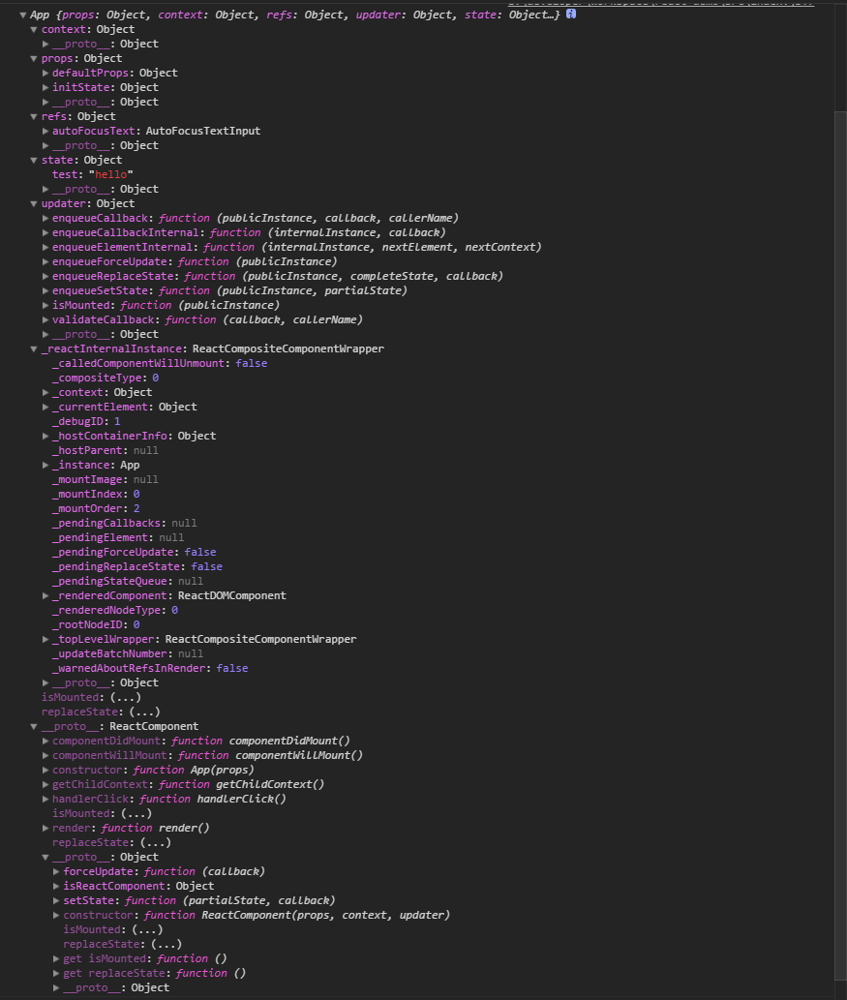

使用create-react-app生成的react开发环境
```js
class App extends Component {
  constructor(props){
    super(props);
    this.state={test:'hello'}
  }
  static defaultProps={
    defaultProps:{
      hello:'hello',
      test:'myTest'
    }
  }
  getChildContext(){
    return {app:'app'}
  }
  componentWillMount(){
    console.log('componentDidMount',PropTypes)
  }
  componentDidMount(){
    console.log('componentDidMount')
  }
  handlerClick(){
    console.log('handlerClick')
  }
  render() {
    return (
      <div className="App">
        <div className="App-header">
          
          <h2>Welcome to React</h2>
        </div>
        <p className="App-intro">
          To get started, edit <code>src/App.js</code> and save to reload.
        </p>
        <AutoFocusTextInput/>
      </div>
    );
  }
}
App.childContextTypes = {
  app:PropTypes.string
}
//ReactDOM.render第三个参数回调函数，在react内部被调用
//`callback.call(componentInstance._renderedComponent.getPublicInstance());`
ReactDOM.render(<App initState={{data:'lotsOfData'}}/>, document.getElementById('root'),function(i){console.log(this)});

```
在浏览器控制台可以看到下图结构

可以看出组件App中定义的方法都被添加到原型ReactComponent对象中了。而且添加了updater和_reactInternalInstance<ReactCompositeComponentWrapper>。
可以在控制台，找出整个App组件元素的树型结构。
在阅读源码时，结合控制台输出的App组件结构，会更容易理解源码。


总体的挂载流程

1. 判断是否已经执行过ReactDOM.render()，如果是进行更新操作。否则执行3
2. 判断是否是服务器端渲染，如果是进行标记。执行3
3. 执行新组件的挂载操作。实例化组件，初始化批量挂载组件环境。 `ReactUpdates.batchedUpdates`,作用是挂载过程，如果有setState类似操作，进行事后处理。
4. 将挂载操作事务化。  `ReactReconcileTransaction` 即 ReactReconcile事务：显然，是将ReactReconcile这一过程的事务化。作用：①维护一个callback对列，在挂载完成或更新完成后在事务的close阶段调用。
5. 递归挂载组件返回markup。 `ReactReconciler.mountComponent`顾名思义 React调和 挂载组件 ，调和的过程是React思想的精髓。diff过程融入其中。[reconciliation](https://facebook.github.io/react/docs/reconciliation.html)
6. 并将markup插入container，这一步中，如果是服务器端渲染，进行校验和判断。

transaction很巧妙

基本概念
`reconsiler`:调度者，reconciliation（n. 和解；调和；和谐；甘愿） algorithm：可以理解为调度算法
无论是DOM元素还是用户自定义组件都会被转化为ReactElement。
`publicInstance`：用户自定义组件实例。
`internalInstance`：ReactElement对应的内部实例，也可以说是用户自定义组件对应的实例。
`publicInstance`和`internalInstance`这两个对象是相互引用的。
从上图就可以看出。
`App`就是`publicInstance`，`_reactInternalInstance`就是`App`引用的内部实例。
`_reactInternalInstance`有个`_instance`属性，是对`App`的引用。

* shouldComponentUpdate(nextProps, nextState, nextContext)
* componentWillUpdate(nextProps, nextState, nextContext);

* context
  `contextType`:设置该属性的组件，则在该组件内部可以通过this.context获取到contex。
  `childContextTypes`:设置该属性的组件，可以设置向下传递context对象的属性的类型。
  `getChildContext()`：该函数设置可以向下传递的context对象属性。必须要在childContextTypes设置属性类型。
  特点：只要在一个组件设置了context，则在其后代组件中都可以获取到。
       如果后代组件也设置了context，向下传递的context是`Object.assign({}, currentContext, childContext);`
       `currentContext`:是从父组件传下来的Context（unmaskedContext）。
       `childContext`:是当前组件设置的childContext。
 当前组件对应的`internalInstance._context=currentContent`
 当前组件`publicInstance`只能根据`contextType`，从`currentContext`生成对应的`context`。

* refs
ref:自定义组件，可以在render函数中返回的内容中设置ref属性，可以在组件实例的refs属性中获得对应的引用。
  可以应用自定义组件，也可以引用原生DOM元素。

`ReactElement._owner`：指向render出该元素的自定义组件对应的internalInstance。

React 挂载和更新都是从最外层开始以递归形式进行。
react 在mount阶段
如果有多个组件调用setState，组件并不会立即更新，只是将更新信息加入更新栈，等到mount阶段结束后，统一的执行更新组件操作。
这时会以栈的特性进行更新。更新会由外而内进行。


https://github.com/facebook/react/issues/8854

React diff算法从15.0开始改变。
React 的事件注册机制16.0后改变。

ReactElement：
```js
{
    // This tag allow us to uniquely identify this as a React Element
    $$typeof: REACT_ELEMENT_TYPE,
    // Built-in properties that belong on the element
    type: type,
    key: key,
    ref: ref,
    props: {
      children:[],//Array<ReactElement>
      className:'',//String
      ...
    },
    // Record the component responsible for creating this element.
    _owner: owner,
};
```
```js
//ReactDOMComponent
Object.assign(
  ReactDOMComponent.prototype,
  ReactDOMComponent.Mixin,
  ReactMultiChild
);
/**
 * Provides common functionality for components that must reconcile multiple
 * children. This is used by `ReactDOMComponent` to mount, update, and
 * unmount child components.
 * ReactMultiChild为那些需要调度（调和）多个children的组件提供通用的功能函数。
 * ReactDOMComponent挂载、更新和卸载孩子组件的时候会使用这些函数。
 * 只要是 ReactDOMComponent ，在更新多个child的时候，都会走这一步，因此
 * ReactMultiChild.js文件里的全局的对象都是共享的。
 * 
 * https://github.com/facebook/react/commits/v15.0.0-rc.1/src/renderers/shared/reconciler/ReactMultiChild.js
 * Commits on Nov 26, 2015,Kill global queue in ReactMultiChild。更新方法发生改变
 * https://github.com/facebook/react/pull/5547
 * https://github.com/facebook/react/pull/1157
 * 大致是说有两个根节点的情况，两个根节点同时触发更新操作，这时可能出问题。
 * 现在更新是同一层级兄弟节点一起更新。子节点比父节点先更新
 */
ReactMultiChild={
  updataChildren,//更新children，有diff算法。
  updateMarkup,
  updateTextContent,
  mountChildren,
  unmountChildren
}
/**
 * ReactChildReconciler provides helpers for initializing or updating a set of
 * children. Its output is suitable for passing it onto ReactMultiChild which
 * does diffed reordering and insertion.
 */
//调度children的初始化、更新、卸载。本身只是一个helper，
ReactChildReconciler={
  instantiateChildren,
  updateChildren,
  unmountChildren
}
//DOMChildrenOperations.processUpdates处理的更新类型
//插入新节点、移动已有元素、插入HTML字符串、文本内容，删除节点。
['INSERT_MARKUP','MOVE_EXISTING','SET_MARKUP','TEXT_CONTENT','REMOVE_NODE']
//一个更新条目数据结构
{
  type: 'TEXT_CONTENT',//更新类型
  content: textContent,//文本内容，包括markup（html字符串）
  fromIndex: null,//老集合中元素位置
  fromNode: null,//老ReactElement渲染出来的dom元素
  toIndex: null, //新集合元素位置
  afterNode: null,//新集合中上一个兄弟元素
};

```
lastIndex：这是一种顺序优化，lastIndex一直在更新，代表了当前访问的最右的老的集合的元素。
> 建议：在开发过程中，尽量减少类似将最后一个节点移动到列表首部的操作，当节点数量过大或更新操作过于频繁时，在一定程度上会影响 React 的渲染性能。

>React15.0以前，将更新内容映射到真实DOM，这一过程是最后通过一个更新动作批量进行。
>React15.0到我分析的16.0.0-alpha.3 ，更新过程不是最后全部批量更新，而是在递归的过程中进行的更新。更新的过程是大致按照树的先序遍历顺序进行的。同一层级的删除节点过程在最后进行。 
> 都是通过DOMChildrenOperations.js这个文件进行最后更新dom。文件所在位置有所变动。
```js
  parentNode.insertBefore(newNode,null);
  parentNode.append(newNode);
  //上面两个等价
  var ul=document.getElementsByTagName('ul')[0];
  var li0 = ul.firstChild;
  ul.insertBefore(li0,null);//会将ul的第一个孩子li，移动到ul最后。
  //再react中不要手动操作真实dom，因为真实dom是根据虚拟dom生成的。
```
> 翻译：so <object> must also be populated prior to insertion into the DOM.插入DOM之前，也必须填充对象
